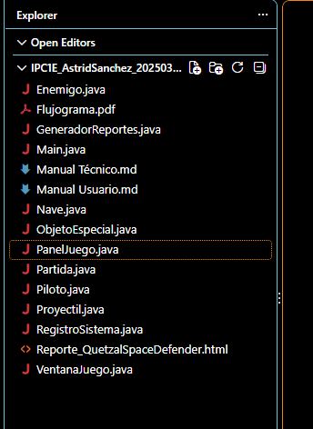
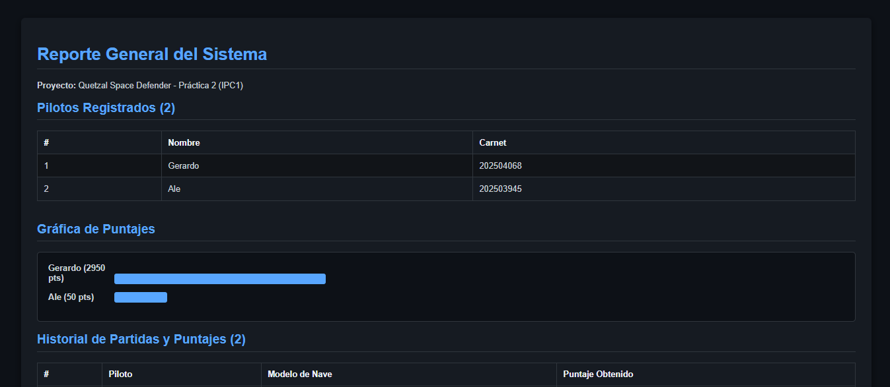

## Información del proyecto

**Universidad de San Carlos de Guatemala (USAC)**  
**Facultad de Ingeniería**  
**Escuela de Ciencias y Sistemas**

**Curso:** Introducción a la Programación y Computación 1 (IPC1)  
**Semestre:** Segundo Semestre 2026  
**Proyecto:** Quetzal Space Defender
### Datos del estudiante

- **Nombre:** Astrid Alejandra Sanchez Pérez
- **Carné:** 202503945
- **Carrera:** Ingeniería en Ciencias y Sistemas

---

# MANUAL TÉCNICO COMPLETO - PROYECTO QUETZAL SPACE DEFENDER

## 1. INTRODUCCIÓN Y JUSTIFICACIÓN TÉCNICA

El presente documento detalla la arquitectura, el diseño lógico, los patrones de programación, la gestión de estructuras de memoria y los algoritmos implementados en el desarrollo de la aplicación **Quetzal Space Defender**.

Desarrollado en su totalidad en el lenguaje **Java**, este software cumple estrictamente con el paradigma de la **Programación Orientada a Objetos (POO)**. Su propósito fundamental es simular un videojuego interactivo de tipo arcade en dos dimensiones (2D), garantizando un rendimiento fluido, modularidad estricta y cumplimiento absoluto de las restricciones académicas, tales como la prohibición de utilizar la API de Colecciones (`Collections API`) y la implementación nativa de la persistencia de datos y generación de reportes mediante el paquete `java.io`.

> 
> 

## 2. ARQUITECTURA GENERAL DEL SISTEMA Y DIAGRAMA DE BLOQUES

El software se encuentra estructurado bajo un diseño desacoplado. Cada clase cumple con una responsabilidad única, lo que facilita el mantenimiento, la depuración y la escalabilidad del código fuente:

- **Capa de Entrada y Control (`Main.java`):** Gestiona la interfaz de usuario basada en consola mediante un ciclo interactivo robusto.
- **Capa de Negocio y Entidades de Datos (`Piloto.java`, `Nave.java`, `Partida.java`):** Modela los objetos de dominio del problema.
- **Capa de Almacenamiento Interno (`RegistroSistema.java`):** Administra los vectores estáticos de memoria para usuarios y registros históricos.
- **Capa de Entidades Dinámicas (`Proyectil.java`, `Enemigo.java`, `ObjetoEspecial.java`):** Modela los elementos móviles con coordenadas cartesianas en tiempo real.
- **Capa Gráfica y de Físicas (`VentanaJuego.java`, `PanelJuego.java`):** Controla el bucle del juego (*game loop*), el renderizado visual y las colisiones matemáticas.
- **Capa de Persistencia Externa (`GeneradorReportes.java`):** Exporta los datos a un formato web interactivo con estilos modernos.

> 

## 3. DESCRIPCIÓN PROFUNDA Y EXHAUSTIVA DE CADA CLASE

### 3.1. `Piloto.java` (Entidad de Usuario)

Esta clase representa la abstracción de un usuario dentro del sistema.

- **Atributos:**
  - `private String nombre`: Almacena el nombre del jugador.
  - `private String carnet`: Almacena el identificador único o carnet del estudiante/usuario.
- **Métodos y Diseño:** Cuenta con un constructor parametrizado para inicializar los atributos mediante la referencia `this`, así como métodos de acceso (`getters` y `setters`) que garantizan el principio de encapsulamiento de la POO, impidiendo modificaciones externas no controladas.

### 3.2. `Nave.java` (Configuración de Rendimiento)

Modela las características físicas y operativas de la nave seleccionada por el jugador.

- **Atributos:**
  - `private String tipoNave`: Define si es *Explorador*, *Caza Estelar* o *Acorazado*.
  - Variables de velocidad y cadencia de disparo.
- **Métodos y Diseño:** Su constructor evalúa mediante una estructura condicional el tipo de nave seleccionado en consola, asignando los parámetros de dificultad correspondientes.

### 3.3. `Partida.java` (Registro Histórico)

Representa una sesión de juego finalizada.

- **Atributos:** `String nombrePiloto`, `String tipoNave`, `int puntaje`.
- **Métodos y Diseño:** Funciona como un objeto contenedor (*Data Transfer Object*) que empaqueta los datos de una partida para ser insertados en el vector de historial.

### 3.4. `RegistroSistema.java` (El Administrador de Memoria y Vectores)

Es el núcleo administrativo del programa. Gestiona tanto el alta de usuarios como el historial de juego.

- **Estructuras de Datos Implementadas (Vectores Nativos):**
  - `private Piloto[] listaPilotos;` (Arreglo estático de tamaño fijo).
  - `private int totalPilotos;` (Contador o puntero manual de control).
  - `private Partida[] historialPartidas;` (Arreglo estático con capacidad para 100 registros).
  - `private int totalPartidas;` (Contador manual de partidas jugadas).
- **Algoritmos y Métodos Principales:**
  - `registrarPiloto(String nombre, String carnet)`: Evalúa primero si `totalPilotos >= listaPilotos.length` para evitar un desbordamiento de memoria (`ArrayIndexOutOfBoundsException`). Si hay espacio, verifica que el carnet no exista previamente y procede a guardar el objeto en la posición `listaPilotos[totalPilotos]`, incrementando el contador en uno.
  - `mostrarTopPuntajes()`: Copia el historial activo a un arreglo temporal y aplica el **Algoritmo de Burbuja (Bubble Sort)** modificado en orden descendente para mostrar las mejores puntuaciones sin alterar el orden original de almacenamiento.

### 3.5. `Proyectil.java`, `Enemigo.java` y `ObjetoEspecial.java` (Entidades Dinámicas)

Estas clases modelan los objetos que interactúan en el plano cartesiano del juego:

- `Proyectil`: Incrementa su coordenada `X` en cada ciclo para simular el avance del disparo láser. Cuenta con un booleano `activo` para su reciclaje.
- `Enemigo`: Decrementa su coordenada `X` para avanzar de derecha a izquierda. Al salir del área visible, reaparece al lado opuesto.
- `ObjetoEspecial`: Administra los elementos de bonificación (*Núcleo de Energía*, *Asteroide* y *Cápsula*), diferenciando su comportamiento mediante un atributo de tipo `String`.

### 3.6. `PanelJuego.java` y `VentanaJuego.java` (Motor Gráfico y Físico)

- `VentanaJuego`: Extiende de `JFrame`, configurando las dimensiones fijas (`800x600`), el título dinámico y la operación de cierre.
- `PanelJuego`: Extiende de `JPanel` e implementa las interfaces `ActionListener` y `KeyListener`. Es el componente más robusto, ya que gestiona el ciclo de vida del juego, la renderización gráfica por fotogramas, la captura de las teclas `W`, `S` y `Espacio`, y la evaluación de colisiones.

> 


## 4. GESTIÓN DE HILOS Y TIEMPOS (`Timer` de Swing)

Para lograr una ejecución fluida y en tiempo real sin caer en la complejidad de la gestión manual de hilos de nivel de sistema operativo (`Thread`), se implementó un **`javax.swing.Timer`** configurado a un intervalo exacto de **20 milisegundos**.

- **Fundamento Técnico:** El temporizador dispara periódicamente el método `actionPerformed` dentro del hilo de despacho de eventos de la interfaz gráfica (*Event Dispatch Thread* - EDT).
- **Resultado:** Esto genera de forma matemática una tasa constante aproximada de **50 fotogramas por segundo (FPS)**. En cada "tick" del temporizador, el sistema recalcula posiciones, actualiza contadores de efectos especiales (como el bloqueo por asteroide) y evalúa colisiones, garantizando una experiencia interactiva sin interrupciones ni bloqueos de la interfaz.

## 5. LÓGICA DE COLISIONES (Modelo Matemático AABB)

La detección de colisiones entre la nave del jugador, los proyectiles, los enemigos y los objetos especiales se resolvió utilizando el modelo matemático de cajas delimitadoras alineadas a los ejes (**AABB - Axis-Aligned Bounding Box**).

- **Principio Físico-Matemático:** Dos objetos rectangulares en un plano bidimensional colisionan si y solo si se solapan simultáneamente en ambos ejes cartesianos (`X` e `Y`).
- **Implementación en Código:**

  ```java
  if (x1 < x2 + ancho2 && x1 + ancho1 > x2 && 
      y1 < y2 + alto2 && y1 + alto1 > y2) {
      // Se detecta colisión efectiva
  }

  ```
- **Aplicación práctica:** Si esta condición evalúa como verdadera entre la nave (`x=50`, `y=playerY`) y un enemigo, el sistema activa de inmediato la bandera `juegoTerminado = true`, detiene el temporizador y registra automáticamente la puntuación final en el historial.

## 6. CUMPLIMIENTO DE RESTRICCIONES: VECTORES NATIVOS VS. COLLECTIONS API

Una de las directrices más críticas de la práctica fue la **prohibición absoluta del uso del paquete `java.util.*` y sus clases dinámicas** (`ArrayList`, `LinkedList`, `HashMap`, etc.).

- **Decisión de Arquitectura:** Se diseñó todo el almacenamiento interno utilizando **arreglos estáticos nativos de Java** con asignación de memoria contigua en el Heap del sistema (por ejemplo, `Proyectil[] proyectiles = new Proyectil[100];`).
- **Control de Límites:** Al no contar con un método `.add()` dinámico que expanda el arreglo automáticamente, se implementaron validaciones estrictas de índices utilizando contadores enteros (`totalProyectiles`, `totalEnemigos`). Si un vector alcanza su capacidad máxima, el sistema bloquea de forma segura nuevas inserciones, evitando por completo excepciones fatales en tiempo de ejecución de tipo `ArrayIndexOutOfBoundsException`.

## 7. SISTEMA DE REPORTES Y PERSISTENCIA DE ARCHIVOS (`java.io`)

La exportación de los datos almacenados en memoria hacia un medio físico externo se ejecuta mediante las clases nativas del paquete `java.io`.

- **Clases Utilizadas:** `FileWriter` (para abrir el canal de flujo de caracteres hacia el disco duro) y `PrintWriter` (para redactar de forma eficiente líneas estructuradas de texto plano con formato HTML).
- **Manejo Seguro de Recursos (`Try-With-Resources`):** La apertura del archivo se ejecuta dentro de un bloque try con recursos:

  ```java
  try (PrintWriter writer = new PrintWriter(new FileWriter("Reporte.html"))) {
      // Escritura de etiquetas HTML
  } catch (IOException e) { ... }

  ```
  Esto garantiza que Java cierre el archivo de manera obligatoria al terminar la ejecución, evitando fugas de memoria o bloqueos de acceso en el sistema operativo.
- **Gráfica de Rendimiento CSS:** El archivo HTML resultante no solo muestra tablas tabuladas limpias, sino que incorpora contenedores estilizados con estilos CSS (`width: Xpx`) que transforman los puntajes numéricos en barras estadísticas visuales totalmente funcionales sin dependencias externas.
> 