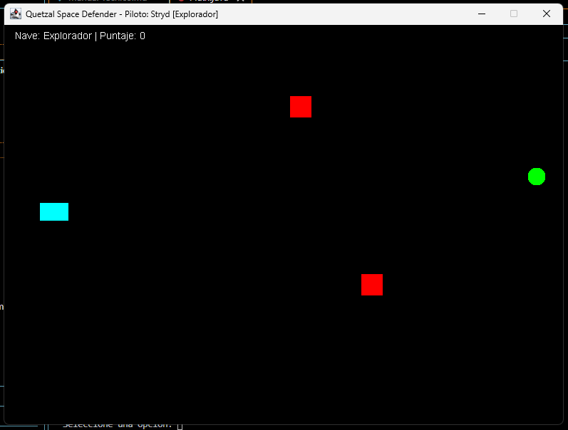
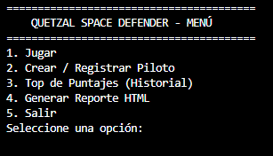
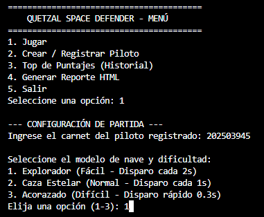
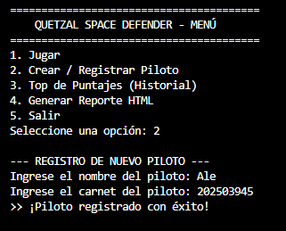
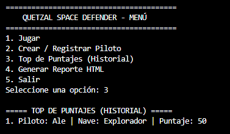
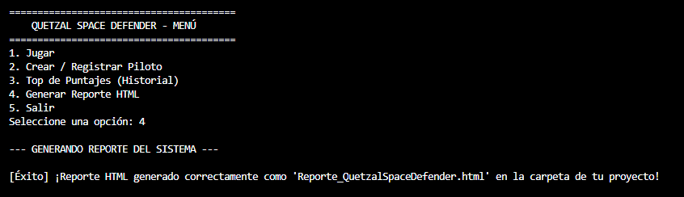
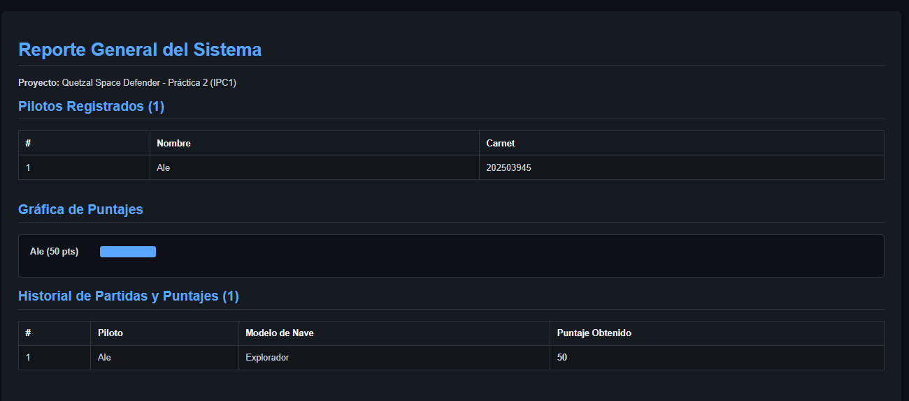
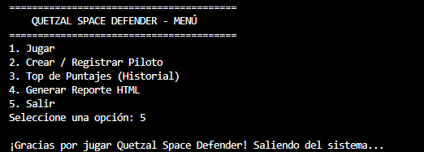
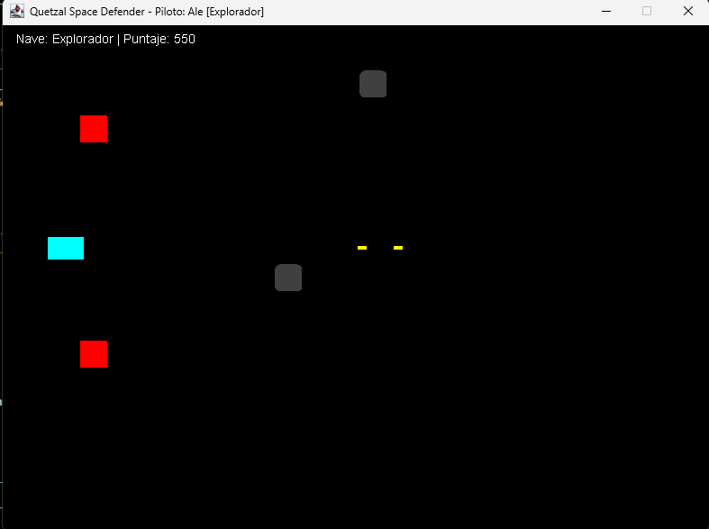
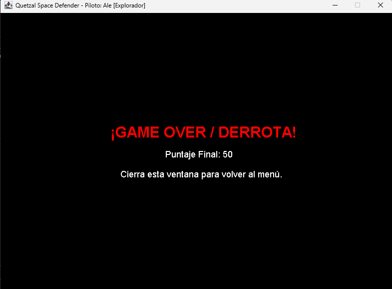

## Información del proyecto

**Universidad de San Carlos de Guatemala (USAC)**  
**Facultad de Ingeniería**  
**Escuela de Ciencias y Sistemas**

**Curso:** Introducción a la Programación y Computación 1 (IPC1)  
**Semestre:** Segundo Semestre 2026  
**Proyecto:** Quetzal Space Defender
### Datos del estudiante

- **Nombre:** Astrid Alejandra Sanchez Pérez
- **Carné:** 202503945
- **Carrera:** Ingeniería en Ciencias y Sistemas

---

# MANUAL DE USUARIO COMPLETO - PROYECTO QUETZAL SPACE DEFENDER

## 1. DESCRIPCIÓN GENERAL DE LA APLICACIÓN

**Quetzal Space Defender** es un videojuego interactivo de tipo arcade en dos dimensiones (2D), diseñado y optimizado para ejecutarse en computadoras de escritorio bajo entornos con soporte para Java.

El usuario asume el rol operativo de una nave de defensa espacial. El objetivo principal de la simulación es maniobrar a través del espacio, esquivar obstáculos móviles, destruir naves enemigas mediante disparos láser y recolectar elementos especiales de bonificación para acumular la mayor cantidad de puntos posibles y posicionarse en la élite del historial del sistema.

> 

## 2. REQUISITOS TÉCNICOS PREVIOS

Para garantizar el funcionamiento óptimo de la aplicación en tu equipo, asegúrate de contar con los siguientes requerimientos:

- **Entorno de Ejecución:** Máquina Virtual de Java (JVM) instalada en su versión **Java SE 8 o superior**.
- **Herramientas de Consola:** Símbolo del sistema (CMD), PowerShell de Windows o la terminal integrada de Visual Studio Code.
- **Variables de Entorno:** El compilador de Java (`javac`) y el intérprete (`java`) deben estar correctamente configurados en el sistema operativo.

## 3. GUÍA DE INSTALACIÓN, COMPILACIÓN Y EJECUCIÓN PASO A PASO

Sigue rigurosamente los siguientes pasos para poner en marcha el programa desde cero:

1. **Ubicación de Archivos:** Coloca todos los archivos con extensión `.java` del proyecto dentro de una misma carpeta en tu computadora (por ejemplo, en el directorio raíz de trabajo).
2. **Apertura de Terminal:** Abre tu terminal de comandos y navega hasta la ruta exacta de la carpeta del proyecto utilizando el comando `cd`.
3. **Compilación del Código Fuente:** Ejecuta el comando de compilación universal para traducir todos los archivos de texto Java a archivos binarios ejecutables (`.class`):

   ```bash
   javac *.java
   ```

4. **Ejecución del Programa:** Una vez concluida la compilación sin errores, inicia la aplicación ejecutando la clase principal:

   ```bash
   java Main
   ```



## 4. GUÍA DEL MENÚ PRINCIPAL Y SUS OPCIONES

Al ejecutar exitosamente el programa, se desplegará en la consola un menú interactivo basado en opciones numéricas:

- **1. Jugar:** Permite iniciar una simulación gráfica. Al seleccionarla, el sistema solicitará el carnet de un piloto previamente registrado. Validará su existencia y te pedirá elegir el modelo de nave y dificultad, abriendo de inmediato la ventana gráfica del juego.

- **2. Crear / Registrar Piloto:** Opción obligatoria antes de jugar. Solicita al usuario ingresar su nombre completo y un número de carnet único, los cuales se almacenarán en el vector estático de control del sistema.

- **3. Top de Puntajes (Historial):** Despliega en la consola un listado ordenado de mayor a menor puntaje basándose en las partidas jugadas, utilizando el algoritmo interno de ordenamiento.

- **4. Generar Reporte HTML:** Ejecuta el motor de persistencia para exportar un archivo hipertextual completo llamado `Reporte_QuetzalSpaceDefender.html` en la carpeta del proyecto, el cual incluye tablas de usuarios y una gráfica de barras de puntajes.


- **5. Salir:** Finaliza de manera segura el ciclo de ejecución del programa liberando los recursos de consola.


## 5. CONTROLES DE OPERACIÓN EN LA VENTANA GRÁFICA

Una vez que el juego inicia en la ventana emergente de interfaz gráfica, los controles de interacción con el teclado son los siguientes:

- **Tecla `W` o Flecha Arriba (`↑`):** Desplaza la nave del jugador de manera fluida hacia la parte superior de la pantalla del juego.
- **Tecla `S` o Flecha Abajo (`↓`):** Desplaza la nave del jugador hacia la parte inferior de la pantalla.
- **Barra Espaciadora (`Space`):** Acciona el mecanismo de disparo, expulsando un proyectil láser hacia adelante para destruir a los enemigos.

## 6. ELEMENTOS DEL CAMPO DE BATALLA Y MECÁNICAS DE PUNTUACIÓN

Durante tu travesía espacial en el simulador, interactuarás con diversos objetos dinámicos que dictarán el éxito o fracaso de tu partida:

- **Enemigos (Cubos de color Rojo):** Obstáculos móviles que se desplazan horizontalmente de derecha a izquierda. Si el rectángulo de tu nave colisiona con cualquiera de ellos, se activará de inmediato el estado de **Game Over / Derrota** y la partida concluirá. Al destruirlos con tus disparos láser, acumulas **+50 puntos** en tu marcador.
- **Núcleo de Energía (Círculos de color Verde):** Objeto especial de bonificación. Al recolectarlo, otorga **+150 puntos** y ejecuta una limpieza temporal de los enemigos visibles en pantalla.
- **Asteroide (Bloques de color Gris):** Obstáculo especial hostil que, al ser interceptado, provoca un bloqueo temporal de los controles de movimiento de la nave durante 2 segundos.
- **Cápsula de Suministro (Cuadrados de color Morado):** Elemento de aprovisionamiento que otorga **+10 puntos** adicionales al marcador general de la simulación.



